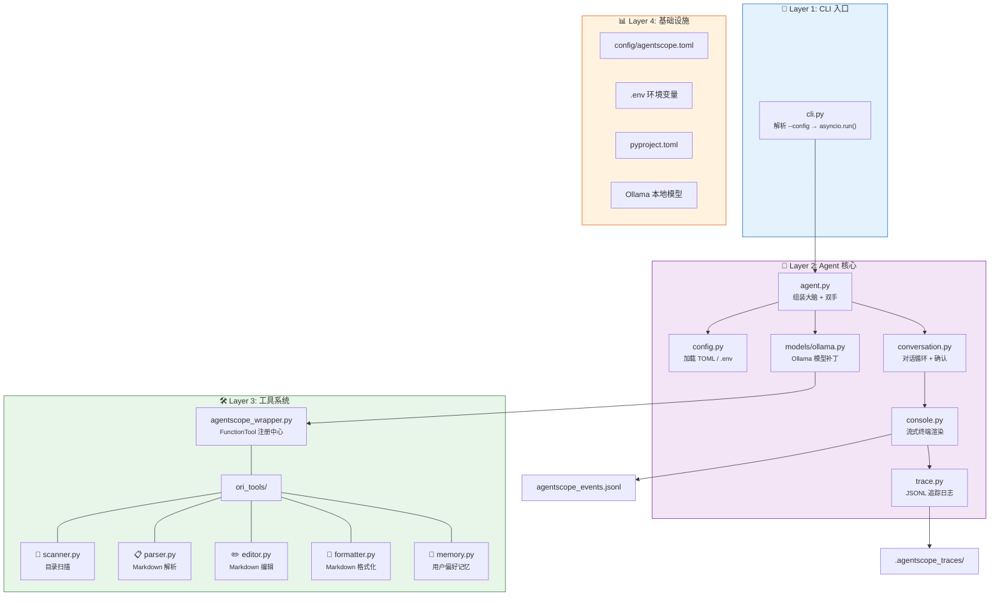
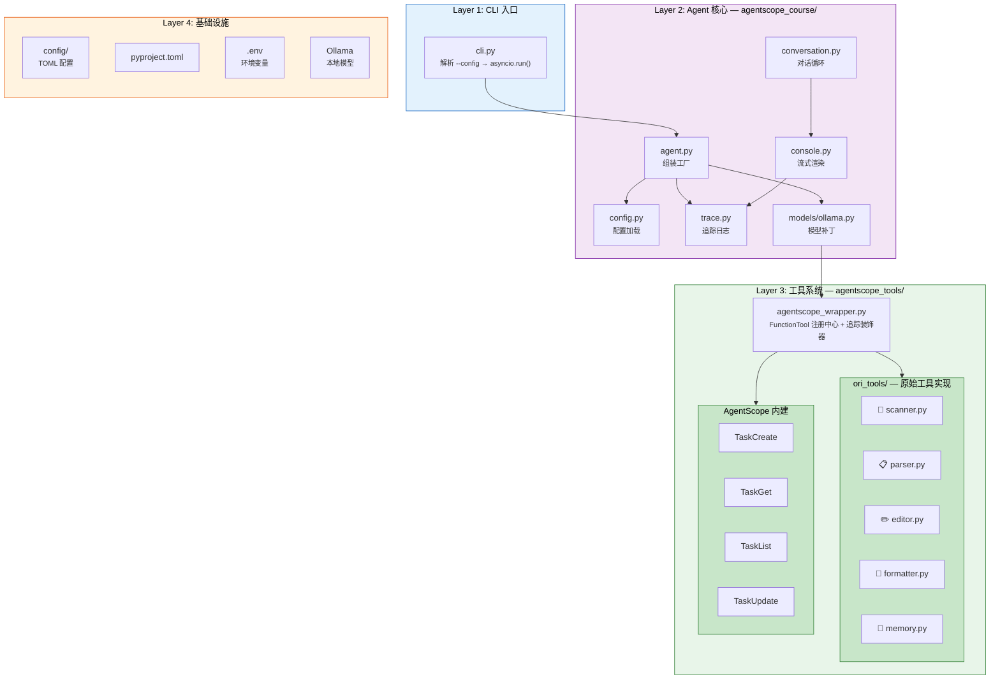
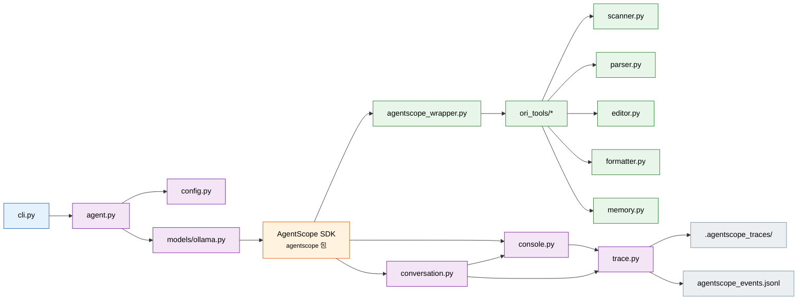
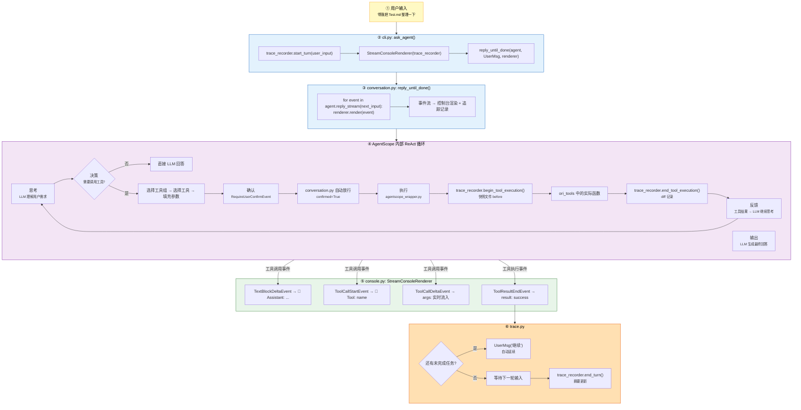

# 02_agentscope — 完整模块文档

> 基于 AgentScope 框架的 Agent 教学项目模块级技术文档。

---

## 文档目录

- [🔧 模块一：CLI 入口](#模块一cli-入口---clipy)
- [🧠 模块二：Agent 核心](#模块二agent-核心---agentscope_course)
- [🛠️ 模块三：工具系统](#模块三工具系统---agentscope_tools)
- [⚙️ 模块四：配置体系](#模块四配置体系)
- [🏗️ 模块五：架构总览](#模块五架构总览)
- [📊 模块六：数据流与事件追踪](#模块六数据流与事件追踪)

---

## 项目全景速览



---

# 模块一：CLI 入口 — `cli.py`

## 文件定位

- **路径**: `src/cli.py`
- **行数**: 26 行
- **依赖**: `agentscope_course.agent`
- **包注册**: `pyproject.toml` → `project.scripts` → `course-agent = "cli:main"`

## 职责

命令行启动入口。负责解析 `--config` 参数并启动 Agent 异步对话循环。

## 源码分析

```python
def main() -> None:
    parser = argparse.ArgumentParser(description="Ask the starter AgentScope agent.")
    parser.add_argument("--config", default=None, help="Path to an AgentScope TOML config file")
    args = parser.parse_args()
    print(asyncio.run(ask_agent(args.config)))
```

### 执行流程

```
main()
  ├── 解析 --config（可选，指定自定义 TOML 配置文件路径）
  ├── asyncio.run(ask_agent(config_path))
  │     └── 进入 agent.py 定义的交互循环
  └── 打印返回值
```

### 关键设计点

1. **最小职责原则** — 只做"解析参数 + 启动循环"两件事，所有业务逻辑委托给下层模块。
2. **异步架构** — 使用 `asyncio.run()` 包装整个 Agent 循环，为流式输出和并发事件处理提供基础。
3. **无状态设计** — 所有状态在 Agent 运行时构造，CLI 入口本身不持有任何全局状态。
4. **命令行入口** — 通过 `pyproject.toml` 的 `[project.scripts]` 注册，支持 `uv run course-agent` 直接调用。

### 重要注释

- `--config` 参数可选，不传时使用默认路径 `config/agentscope.toml`。
- 如果 `load_config(config_path)` 返回空字典（文件不存在），Agent 使用所有默认值运行。

## 运行时调用链

```
uv run course-agent                     # pyproject.toml 入口
  → cli.py:main()                      # 当前模块
    → agent.py:ask_agent(config_path)  # 核心循环启动
      → agent.py:create_agent(config)  # 组装 Agent
        → config.py:load_config()      # 加载配置
        → agent.py:create_model()      # 创建 LLM 模型
        → agent.py:create_toolkit()    # 创建工具集
      → conversation.py:reply_until_done()  # 对话循环开始
```

## 测试与调试

```bash
# 默认运行
uv run course-agent

# 指定自定义配置
uv run course-agent --config /path/to/custom.toml

# 直接 Python 调用
python -m src.cli
```

## 与课程内容的关联

- **第 1 章《Hello Agent!》** — 学生第一个接触的文件
- **第 2 章《Agent 的大脑》** — 通过 `agent.py` 向下深入模型创建
- **第 5 章《看得见的思考》** — 通过 `console.py` 实现流式输出展示

---

# 模块二：Agent 核心 — `agentscope_course/`

## 包概览

- **路径**: `src/agentscope_course/`
- **子模块数**: 5 个核心模块 + 1 个模型适配子包
- **职责**: Agent 的核心逻辑层——大脑(LLM) + 双手(工具) + 感知(事件流)

```
agentscope_course/
├── __init__.py           # 包声明
├── agent.py              # Agent 创建与编排（核心组装厂）
├── config.py             # 配置加载（TOML + .env）
├── console.py            # 终端渲染器（Codex 风格流式输出）
├── conversation.py       # 对话循环（确认处理 + 任务延续）
├── trace.py              # 结构化追踪日志（JSONL + Summary）
└── models/               # 模型适配子包
    ├── __init__.py
    └── ollama.py         # Ollama 模型补丁（修复工具调用 ID 冲突）
```

---

## 2.1 `agent.py` — Agent 创建与编排

- **行数**: 203 行
- **依赖**: `agentscope_course.*`（几乎所有子模块）+ `agentscope_tools`
- **对外接口**: `ask_agent()`, `create_agent()`, `create_model()`, `create_toolkit()`

### 职责

将"大脑"(模型)与"双手"(工具)组装成完整 Agent，并提供交互循环入口。

### 函数详解

#### `create_model(config) → ChatModelBase`

```
create_model()
  ├── load_dotenv()                    # 加载 .env 文件
  ├── 从环境变量 / config 读取参数：
  │   ├── OLLAMA_MODEL / model        # 模型名（默认 qwen3.5:4b-mlx）
  │   ├── stream                      # 是否流式（默认 True）
  │   ├── temperature                 # 创意程度
  │   ├── max_tokens                  # 最大 Token
  │   └── thinking_enable             # 是否启用思考链
  ├── 创建 PatchedOllamaChatModel.Parameters()
  ├── 可选 OLLAMA_HOST 配置 OllamaCredential()
  └── return PatchedOllamaChatModel()
```

**设计要点**:
- 使用 `PatchedOllamaChatModel`（[见 2.6 节](#26-modelsoilamapy--模型补丁)）而非 AgentScope 原生的 `OllamaChatModel`
- 参数优先级：环境变量 > 配置文件 > 默认值
- `_maybe_number()` 将字符串参数转为数字类型

#### `create_toolkit() → Toolkit`

```python
def create_toolkit():
    from agentscope_tools.agentscope_wrapper import create_markdown_toolkit
    return create_markdown_toolkit()
```

**设计要点**:
- 延迟导入（lazy import）避免启动时循环依赖
- 委托给 `agentscope_tools` 模块完成所有工具注册逻辑

#### `create_agent(config) → Agent`

```
create_agent()
  ├── load_config() → 加载 TOML
  ├── Agent(
  │     name=config["name"],
  │     system_prompt=config["system_prompt"],
  │     model=create_model(model_config),
  │     toolkit=create_toolkit(),
  │     react_config=ReActConfig(max_iters=N)
  │   )
  └── 注入初始用户记忆到 agent.state.context
```

**设计要点**:
- `max_iters` 控制单次任务最大思考步数（默认 20，配置中为 30）
- Agent 启动时自动注入 `init_user_memory()` 作为首次对话上下文
- `ReActConfig` 启用 AgentScope 的 ReAct 推理循环

#### `ask_agent(config_path) → None`

这是整个 Agent 的主循环入口：

```
ask_agent(path)
  ├── create_agent(load_config(path))
  ├── TraceRecorder() → 初始化追踪日志
  ├── WHILE LOOP:
  │   ├── input("🧑 You: ") 或 预填测试 prompt
  │   ├── 'quit' → 退出
  │   ├── trace_recorder.start_turn(user_input)
  │   ├── StreamConsoleRenderer(trace_recorder)
  │   ├── trace_recorder_context → 设置上下文变量
  │   ├── reply_until_done(agent, msg, renderer)
  │   └── EXCEPTION → trace_recorder.record_local_event("turn_error", ...)
  └── FINALLY: trace_recorder.close()
```

**设计要点**:
- 内置一个标准测试 prompt（30+ 行），用于快速验证 Agent 全流程
- `trace_recorder_context` 使用 `contextvars` 确保工具调用能追踪到对应的 recorder
- 异常被记录到 trace 后重新抛出（不静默吞掉）
- `KeyboardInterrupt/EOFError` 捕获后优雅退出

### 测试 Prompt 结构

`ask_agent()` 中的硬编码测试 prompt 包含 9 个步骤，覆盖了所有主要功能路径：

| 步骤 | 操作 | 涉及模块 |
|------|------|---------|
| 1 | 读取记忆中的文件 | memory → scanner |
| 2 | 使用 Plan Mode | task_management |
| 3 | 识别文档结构 | parser (markdown_outline) |
| 4 | 保护章节确认 | parser (markdown_get_section) |
| 5 | 读取指定章节 | parser |
| 6 | 重写风险章节 | editor (markdown_replace_section) |
| 7 | 插入新章节 | editor (markdown_insert_after_heading) |
| 8 | 更新任务状态 | editor (markdown_update_task_status) |
| 9 | 格式化检查 | formatter (markdown_check_format) |

---

## 2.2 `config.py` — 配置加载

- **行数**: 51 行
- **依赖**: `tomllib`（Python 3.11+ 内置）+ `dotenv`

### 职责

加载 TOML 配置文件和 `.env` 环境变量。

### 常量

| 常量 | 值 | 说明 |
|------|-----|------|
| `PROJECT_ROOT` | `Path(__file__).resolve().parents[2]` | 项目根目录（`src/agentscope_course/` → `src/` → 根） |
| `DEFAULT_CONFIG_PATH` | `PROJECT_ROOT / "config/agentscope.toml"` | 默认配置文件路径 |
| `DEFAULT_ENV_PATH` | `PROJECT_ROOT / ".env"` | 默认环境变量文件 |

### 函数详解

| 函数 | 说明 | 关键细节 |
|------|------|---------|
| `load_dotenv(path)` | 加载 `.env` 但不覆盖已存在的环境变量 | `override=False` |
| `load_config(path)` | 加载 TOML 配置 | 支持 `AGENTSCOPE_CONFIG` 环境变量覆盖路径 |
| `_maybe_number(value)` | 字符串→数字类型转换 | `int > float > str` 优先级 |

### 配置优先级

```
--config 参数 > AGENTSCOPE 环境变量 > 默认 config/agentscope.toml > 不存在则返回 {}
```

---

## 2.3 `console.py` — 终端渲染器

- **行数**: 678 行（本项目最大的文件）
- **依赖**: `rich`（终端美化）+ `trace.py`
- **核心类**: `StreamConsoleRenderer`

### 职责

实现 Codex/Claude Code 风格的实时终端交互体验——文字流式输出、工具调用实时展示。

### 架构

```
StreamConsoleRenderer
  ├── 状态管理
  │   ├── _ToolRenderState  dataclass  ← 单个工具调用的渲染状态
  │   └── _ToolBatchState   dataclass  ← 一次 Agent 回复中的工具调用组
  │
  ├── 事件处理 (render 方法)
  │   ├── TextBlockDeltaEvent    → _render_text()         ← 文字流式输出
  │   ├── ToolCallStartEvent     → _render_tool_start()   ← 工具调用开始
  │   ├── ToolCallDeltaEvent     → _render_tool_args()     ← 参数实时流入
  │   ├── ToolCallEndEvent       → _render_tool_call_end() ← 参数收集完成
  │   ├── RequireUserConfirmEvent→ _render_tool_confirmation_request()
  │   ├── ToolResultStartEvent   → _render_tool_result_start()
  │   ├── ToolResultTextDeltaEvent→ _collect_tool_output()
  │   ├── ToolResultDataDeltaEvent→ _render_tool_data()
  │   └── ToolResultEndEvent     → _render_tool_result_end()
  │
  ├── 日志记录
  │   ├── _log_agent_event()     ← 记录 AgentScope 原始事件
  │   ├── _log_local_event()     ← 记录自定义事件（确认/阻塞/延续）
  │   └── _write_event_log()     ← 写入 agentscope_events.jsonl
  │
  └── Live 渲染
      ├── _start_live()          ← 启动 rich.Live（自刷新面板）
      ├── _refresh_live()        ← 刷新渲染
      ├── _stop_live()           ← 停止 Live，固定输出
      └── _render_active_batch() ← 构建工具调用面板（Tree → Panel）
```

### 工具调用渲染面板

当 Agent 发起工具调用时，终端上会显示一个 `rich.Panel`，使用树形结构展示：

```
┌──────────────────────────────────────────────┐
│ 🧰 Tool batch #1 · 2 calls                   │
│                                              │
│ 🔧 [1/2] markdown_outline · abc123...def     │
│   args: {"path": "Test.md"}                  │
│   status: running                            │
│                                              │
│ 🔧 [2/2] markdown_get_section · abc789...xyz │
│   args: {"path": "Test.md", ...}             │
│   status: finished                           │
│   result: success                            │
└──────────────────────────────────────────────┘
```

### Unicode 中文解码

`decode_unicode_chinese()` 函数专门处理工具参数中的 `\uXXXX` 编码，确保中文字符在终端上正常显示。

### 输出截断保护

| 常量 | 默认值 | 作用 |
|------|--------|------|
| `_MAX_TOOL_OUTPUT_LINES` | 24 | 工具输出最大预览行数 |
| `_MAX_TOOL_OUTPUT_CHARS` | 4000 | 工具输出最大预览字符 |
| `_EVENT_LOG_PREVIEW_CHARS` | 1000 | 事件日志单字段预览截断 |

### 事件序号追踪

每个事件获得自增的 `seq` 号和 `renderer_id`，便于后续分析和调试。

---

## 2.4 `conversation.py` — 对话循环

- **行数**: 119 行
- **依赖**: `agentscope.*`（事件类型）+ `console.py`
- **核心函数**: `reply_until_done()`

### 职责

管理 Agent 和用户之间的完整对话流程，处理确认请求和任务延续。

### 执行流程

```
reply_until_done(agent, user_msg, renderer)
  │
  ├── WHILE next_input is not None:
  │   ├── agent.reply_stream(next_input) → 事件流
  │   │   └── renderer.render(event) → 实时输出
  │   │
  │   ├── RequireUserConfirmEvent 出现
  │   │   └── _confirm_tool_calls() → 自动放行所有工具
  │   │       └── renderer.record_tool_permission()
  │   │
  │   ├── RequireExternalExecutionEvent 出现
  │   │   └── raise RuntimeError("CLI 无法执行外部工具")
  │   │
  │   └── 所有事件处理完毕：
  │       ├── 有待确认 → UserConfirmResultEvent 作为 next_input
  │       ├── 有未完成任务 → UserMsg("继续任务") 作为 next_input
  │       └── 全部完成 → renderer.close_turn(), next_input = None
  │
  └── 循环结束，等待下一次用户输入
```

### 确认机制（当前实现）

目前**所有工具调用自动放行**（`confirmed = True`），代码中保留了手动确认的注释代码：

```python
# 注释掉的手动确认代码
# renderer.pause_live()
# print(f"⚠️  Tool permission required: {tool_call.name}")
# answer = input("   Allow this tool call? [y/N]: ").strip().lower()
# confirmed = answer in {"y", "yes"}
```

### 任务延续机制

Agent 的 `state.tasks_context.tasks` 中如果有未完成的 Task（不是 `"completed"` 状态），会自动触发延续：

```python
next_input = UserMsg(
    name="user",
    content=f'not finished tasks: {task_ids}. Continue your job.'
)
```

---

## 2.5 `trace.py` — 结构化追踪日志

- **行数**: 538 行
- **依赖**: 标准库（`difflib`, `hashlib`, `json`, `contextvars`）
- **核心类**: `TraceRecorder`

### 职责

记录 Agent 每次运行的完整过程，生成 JSONL 格式的详细事件流和 JSON 格式的运行摘要。

### 架构

```
TraceRecorder
  ├── 运行生命周期
  │   ├── __init__()      → 创建 jsonl + summary 文件，写入 run_start
  │   ├── start_turn()    → 开始一轮对话
  │   ├── end_turn()      → 结束本轮，记录摘要
  │   └── close()         → 写入 run_end, 输出 summary.json
  │
  ├── 事件记录
  │   ├── record_agent_event()       ← AgentScope 原始事件
  │   ├── record_text_delta()        ← 助手文本增量
  │   ├── record_tool_call_start()   ← 工具调用开始
  │   ├── record_tool_call_args_delta() ← 工具参数流动
  │   ├── record_tool_call_ready()   ← 工具参数完整
  │   ├── record_confirmation_request() ← 确认请求
  │   └── record_local_event()       ← 自定义事件
  │
  ├── 工具执行追踪
  │   ├── begin_tool_execution()     → 快照 before 文件状态
  │   └── end_tool_execution()       → 对比 after，生成 diff
  │
  └── 辅助
      ├── pending_tool_calls 列表       ← 待匹配的工具调用
      └── _match_tool_call()            ← 按名称+参数匹配跟踪
```

### 文件结构

每次运行生成一对文件：

```
.agentscope_traces/
├── 20260608-081705-<run_id_prefix>.jsonl        ← 完整事件流
└── 20260608-081705-<run_id_prefix>.summary.json  ← 运行摘要
```

### JSONL 事件类型

| 事件 | 触发时机 | 关键字段 |
|------|---------|---------|
| `run_start` | 追踪器初始化 | `cwd`, `jsonl_path` |
| `turn_start` | 新用户输入 | `turn_index`, `user_input` |
| `turn_end` | 回复完成 | `assistant_text`, `file_changes` |
| `assistant_text_delta` | 文本流每片段 | `delta`, `delta_len` |
| `tool_call_start` | Agent 发出工具调用 | `tool_call_id`, `tool_name` |
| `tool_call_ready` | 参数收集完成 | `args` (已解析 JSON) |
| `tool_execution_start` | 工具实际执行前 | `execution_id`, `candidate_paths` |
| `tool_execution_end` | 工具执行完成 | `status`, `result`, `file_changes` |
| `confirmation_request` | 需要用户确认 | `tool_calls` 列表 |
| `agent_event` | 渲染器收到的原始事件 | `event_class`, `fields` |
| `run_end` | 追踪器关闭 | `turn_count` |

### 文件变更追踪（Diff）

当工具修改文件时，`trace.py` 会自动：

1. 在执行前对候选路径做快照（`FileSnapshot`：`path`, `sha256`, `text`）
2. 执行后重新快照
3. 对比生成 unified diff
4. 记录到 `tool_execution_end` 事件的 `file_changes` 字段

```python
# diff 示例
--- a/Test.md
+++ b/Test.md
@@ -1,6 +1,8 @@
 # 标题
+新内容
```

### 上下文变量（ContextVar）

```python
_CURRENT_RECORDER = contextvars.ContextVar(
    "agentscope_trace_recorder", default=None
)
```

通过 `trace_recorder_context()` 上下文管理器设置，确保工具包装器可以无参获取当前 recorder：

```python
def current_trace_recorder() -> TraceRecorder | None:
    return _CURRENT_RECORDER.get()
```

### 剪枝保护

| 常量 | 默认值 | 说明 |
|------|--------|------|
| `MAX_RECORDED_TEXT_CHARS` | 20000 | 单段文本最大记录长度 |
| `MAX_DIFF_CHARS` | 30000 | 单次 diff 最大长度 |

---

## 2.6 `models/ollama.py` — 模型补丁

- **行数**: 141 行
- **依赖**: `agentscope.model.OllamaChatModel`
- **核心类**: `PatchedOllamaChatModel`

### 职责

修复 AgentScope 官方 Ollama 适配器的一个 Bug：当同一轮回复中多次调用同一个工具时，工具调用 ID 会重复，导致运行时无法区分多个同名工具调用。

### Bug 根因

AgentScope 原生实现使用 `idx`（工具在列表中的索引）和工具名拼接 ID。但如果同一个工具被调用多次，每次调用的索引值相同，导致 ID 重复。

### 修复方式

```python
# AgentScope 原生实现（有 Bug）
tool_id = f"{idx}_{function.name}"  # 不同轮次同工具同索引时冲突！

# PatchedOllamaChatModel 修复方案
tool_id = f"{response_id}_{idx}_{function.name}"  # 加入 response_id 区分
```

`response_id` 来自 Ollama API 响应的 `id` 字段，每次请求都不同，确保了工具调用 ID 的全局唯一性。

### 实现细节

`PatchedOllamaChatModel` 重写了两个方法：

| 方法 | 用途 | 修改要点 |
|------|------|---------|
| `_parse_stream_response()` | 处理流式响应 | 每个工具块 ID 中加入 `response_id` |
| `_parse_completion_response()` | 处理非流式响应 | 同上 |

两个方法都保持了 AgentScope 完整的响应结构：
- `TextBlock` — 文本内容
- `ThinkingBlock` — 思考链内容（当 `thinking_enable=True`）
- `ToolCallBlock` — 工具调用（修复后的 ID）
- `ChatUsage` — Token 用量统计

### 教学内容价值

这个模块是课程的实用亮点之一，"即使是最流行的框架也可能有 Bug，理解原理才能修复它"。

---

# 模块三：工具系统 — `agentscope_tools/`

## 包概览

- **路径**: `src/agentscope_tools/`
- **职责**: 将普通 Python 函数包装为 Agent 可理解的工具，供 LLM 自主调用

```
agentscope_tools/
├── __init__.py                        # 统一导出（兼容层 + 顶层 API）
├── agentscope_wrapper.py              # AgentScope FunctionTool 注册中心
│
├── editor.py                          # 兼容重导出 → ori_tools/editor.py
├── formatter.py                       # 兼容重导出 → ori_tools/formatter.py
├── parser.py                          # 兼容重导出 → ori_tools/parser.py
├── memory.py                          # 兼容重导出 → ori_tools/memory.py
│
└── ori_tools/                         # 工具原始实现（9 个工具）
    ├── __init__.py                    # 统一导出
    ├── scanner.py                     # 📂 目录扫描
    ├── parser.py                      # 📋 Markdown 解析（大纲/章节/任务）
    ├── editor.py                      # ✏️  Markdown 编辑（替换/插入/更新）
    ├── formatter.py                   # 🎨 Markdown 格式化（mdformat）
    └── memory.py                      # 🧠 用户偏好记忆（JSON 文件）
```

---

## 3.1 `__init__.py` — 顶层导出

- **依赖**: `agentscope_tools.ori_tools.*` + `agentscope_wrapper`

统一导出所有工具函数加上 `create_markdown_toolkit` 和 `init_user_memory`。提供了完整的 `__all__` 列表供外部导入。

**关键导出**:

```python
__all__ = [
    "init_user_memory",
    "iter_outline", "markdown_get_section", "markdown_list_tasks",
    "markdown_outline", "markdown_scan_directory",
    "markdown_insert_after_heading", "markdown_replace_section",
    "markdown_update_task_status",
    "markdown_check_format", "markdown_format_file",
    "user_memory_*",  # 6 个记忆工具
    "create_markdown_toolkit",
]
```

---

## 3.2 `agentscope_wrapper.py` — 工具注册中心

- **行数**: 219 行
- **依赖**: `agentscope.tool.*` + `ori_tools.*` + `trace.py`

### 职责

将普通 Python 函数包装为 AgentScope 的 `FunctionTool`，并组织成工具组（`ToolGroup`）注册到 `Toolkit` 中。

### 架构

```
create_markdown_toolkit()
  └── Toolkit(
        skills_or_loaders=SKILLS_ROOTS,   ← 技能文件路径
        tool_groups=[                      ← 4 个工具组
          ToolGroup("markdown_read",    ← 📖 只读工具
            tools=[markdown_scan_directory, markdown_outline,
                   markdown_get_section, markdown_check_format]
          ),
          ToolGroup("markdown_write",   ← ✏️ 写操作工具
            tools=[markdown_replace_section,
                   markdown_insert_after_heading,
                   markdown_format_file]
          ),
          ToolGroup("memory",           ← 🧠 用户偏好
            tools=[user_memory_outline, user_memory_save_preference,
                   user_memory_get_preference, user_memory_list_preferences,
                   user_memory_delete_preference, user_memory_clear_preferences]
          ),
          ToolGroup("task_management",  ← 📋 内部任务规划
            tools=[TaskCreate, TaskGet, TaskList, TaskUpdate]
          ),
        ],
      )
```

### 工具分组策略

| 工具组 | 工具数 | 只读? | 用途 | 安全要求 |
|--------|--------|-------|------|---------|
| `markdown_read` | 4 | ✅ | 扫描、大纲、读取章节、检查格式 | 无风险，自动放行 |
| `markdown_write` | 3 | ❌ | 替换章节、插入内容、格式化 | 写操作需感知 |
| `memory` | 6 | 混合 | 偏好 CRUD + 浏览 | 写入需感知 |
| `task_management` | 4 | ❌ | Agent 内部任务规划 | Agent 内部控制 |

### 工具包装流程

```python
# 1. 原始 Python 函数 → FunctionTool
_function_tool(markdown_outline, is_read_only=True)

# 2. FunctionTool 内部：
#    a. 自动提取函数的 __name__, __doc__, 类型注解
#    b. 生成 Agent 可理解的 name/description/input_schema

# 3. 追踪装饰器（_wrap_tool_result）
#    a. 函数执行前：recorder.begin_tool_execution() → 快照文件
#    b. 函数执行后：recorder.end_tool_execution() → diff + 记录
#    c. 异常 → 记录错误状态
```

### 追踪装饰器 `_wrap_tool_result`

```python
@wraps(func)
def wrapped(**kwargs):
    recorder = current_trace_recorder()
    if recorder:
        execution = recorder.begin_tool_execution(func.__name__, kwargs)
    try:
        result = func(**kwargs)
    except Exception as exc:
        # 记录错误 → 重新抛出
        recorder.end_tool_execution(execution, status="error", error=exc)
        raise
    recorder.end_tool_execution(execution, status="success", result=result)
    return ToolChunk(content=[TextBlock(text=json.dumps(result))])
```

### 内存初始化

`init_user_memory()` 在 Agent 启动时被调用，将记忆信息注入初始对话上下文：

```python
def init_user_memory():
    return [
        TextBlock(text='User Memory outline:'),
        TextBlock(text=_format_tool_result(user_memory_outline())),
        TextBlock(text='User Hard Memories:'),
        TextBlock(text=_format_tool_result(hard_user_memories())),
    ]
```

### 技能文件路径

```python
SKILLS_ROOTS = [
    "项目根/.skills/markdown-workspace",
    "项目根/.skills/plan-mode-task-management",
    "项目根/.skills/user-memory-preferences",
]
```

---

## 3.3 兼容重导出文件

以下文件仅做向后兼容导出，所有真正的实现已迁移到 `ori_tools/`：

| 文件 | 原始位置 → 新位置 | 导出的关键内容 |
|------|-------------------|----------------|
| `editor.py` | → `ori_tools/editor.py` | 所有编辑工具 + 内部函数 |
| `formatter.py` | → `ori_tools/formatter.py` | `markdown_format_file`, `markdown_check_format` |
| `parser.py` | → `ori_tools/parser.py` | 解析工具 + `_containing_section`, `_read_markdown` |
| `memory.py` | → `ori_tools/memory.py` | 所有记忆工具 + `MEMORY_DIR`, `USER_PREFERENCES_PATH` |

---

## 3.4 `ori_tools/scanner.py` — 目录扫描器

- **行数**: 89 行
- **依赖**: 仅标准库（`pathlib`, `typing`）

### 工具接口

```python
markdown_scan_directory(
    path: str | None = None,     # 扫描路径，默认 WORKSPACE_ROOT
    recursive: bool = True,      # 是否递归子目录
    include_hidden: bool = False # 是否包含隐藏文件
) -> dict[str, Any]
```

### 返回值结构

```json
{
  "root": "/Users/.../02_agentscope",
  "workspace": "/Users/.../02_agentscope",
  "recursive": true,
  "include_hidden": false,
  "extensions": [".md", ".markdown"],
  "count": 3,
  "files": [
    {"path": "/abs/path/Test.md", "relative_path": "Test.md", "name": "Test.md", "size_bytes": 2807},
    {"path": "/abs/path/task_demo.md", "relative_path": "task_demo.md", "name": "task_demo.md", "size_bytes": 5179}
  ]
}
```

### 关键设计

| 设计点 | 实现 | 理由 |
|--------|------|------|
| 隐藏文件过滤 | `path.parts` 检查 `.` 开头组件 | 避免扫描 `.git`、`.venv` 等 |
| 后缀过滤 | `{".md", ".markdown"}` | 只处理 Markdown 文件 |
| 绝对路径 | 返回 `Path.resolve()` | 下游工具直接使用，无需关心 CWD |
| 排序 | 按 `relative_path` 排序 | 输出确定性，方便定位 |
| 常量 | `WORKSPACE_ROOT = Path.cwd().resolve()` | 启动时锁定，防止后续 `chdir` 改变语义 |

---

## 3.5 `ori_tools/parser.py` — Markdown 解析器

- **行数**: 241 行
- **依赖**: `markdown-it-py`（MarkdownIt 解析器）

### 工具接口

| 工具 | 参数 | 返回值 | 关键算法 |
|------|------|--------|---------|
| `markdown_outline(path)` | `path` | `list[dict]` 嵌套标题树 | MarkdownIt token 解析 → 栈构建树 |
| `iter_outline(outline)` | `outline` | `list[dict]` 扁平标题列表 | 深度优先遍历（递归） |
| `markdown_get_section(path, heading, occurrence=1)` | `path, heading, occurrence` | `dict` 章节内容 | 定位标题行号 → 范围切片 |
| `markdown_list_tasks(path)` | `path` | `list[dict]` 任务列表 | 正则匹配 `[x]` / `[ ]` |

### `markdown_outline` 算法详解

```
输入: Markdown 文件路径
  │
  ▼
第一步: MarkdownIt 解析 token 流
  │
  ▼
提取 heading_open token:
  - level = tag 中的 h1-h6
  - title = 下一个 inline token 的 content
  - line_start = token.map[0] + 1 (1-based)
  - line_end = token.map[1] (1-based)
  - section_start = line_start
  - section_end = len(lines) (默认全文)
  │
  ▼
计算 section_end:
  每个章节在其后第一个同级或更高级标题前结束
  例如:
    ## A (section: 1-10)
      ### A.1 (section: 3-7)
        #### A.1.1 (section: 5-7)
      ## B → 闭合 A 的 section 到 B-1
  │
  ▼
第二步: 栈构建父子树
  遍历 flat_headings，用栈维护层级嵌套关系
  │
  ▼
输出: [{level, title, line_start, line_end, section_start, section_end, children}]
```

### `markdown_list_tasks` 正则表达式

```python
TASK_RE = re.compile(
    r"^(?P<indent>\s*)"          # 缩进空格
    r"(?P<marker>[-*+])"         # 列表标记 (- * +)
    r"\s+\[(?P<state>[ xX])\]"  # 复选框 [ ] [x] [X]
    r"\s+(?P<text>.*)$"          # 任务文本
)
```

### 查询的章节的关系

`markdown_get_section` 的 `occurrence` 参数支持标题重名：

```python
# Test.md 中有两个 "## 背景"
section = markdown_get_section("Test.md", "背景", occurrence=2)  # 取第二个
```

### `iter_outline` 递归展平

```python
def iter_outline(outline):
    headings = []
    for heading in outline:
        headings.append(heading)
        headings.extend(iter_outline(heading["children"]))
    return headings
```

---

## 3.6 `ori_tools/editor.py` — Markdown 编辑器

- **行数**: 183 行
- **依赖**: `parser.py`（获取章节位置信息）

### 工具接口

| 工具 | 参数 | 底层操作 |
|------|------|---------|
| `markdown_replace_section(path, heading, content, occurrence=1)` | 章节标题 + 替换内容 | 行号范围切片替换 |
| `markdown_insert_after_heading(path, heading, content, occurrence=1)` | 插入点标题 + 内容 | 标题行后插入行 |
| `markdown_update_task_status(path, task_index, done)` | 任务索引 + 新状态 | 字符串替换 `[ ]` / `[x]` |

### 核心设计原则

#### 行号操作（非全文正则替换）

所有编辑器都基于解析器提供的**行号信息**进行操作：

```python
# 替换章节：精确的行号范围切片
lines[old_start - 1 : old_end] = replacement

# 插入内容：精确的行号插入点
lines[insert_at:insert_at] = insertion

# 更新任务状态：精确的行号定位
lines[line_index] = old_line.replace("[x]", "[ ]", 1)
```

#### 最小修改原则

每次修改只改动目标范围，文件其他部分完全不动。

#### `markdown_replace_section` 算法

```
1. markdown_get_section → 获取 section_start, section_end
2. _read_lines → 行列表（保留换行符）
3. _content_lines → 确保内容以 \n 结束
4. lines[old_start-1:old_end] = replacement
5. _write_lines → 写回文件
6. 返回 old_range / new_range / line_delta
```

#### `markdown_update_task_status` 算法

```
1. markdown_list_tasks → 获取任务列表（含 line, done, text）
2. 按 task_index 定位目标行 line_index
3. 字符串替换：
   [x] → [ ] (标记为未完成)
   [ ] → [x] (标记为完成)
4. 只替换 checkbox 区域，不涉及其他文本
```

---

## 3.7 `ori_tools/formatter.py` — Markdown 格式化器

- **行数**: 70 行
- **依赖**: `mdformat`, `mdformat-gfm`

### 工具接口

| 工具 | 参数 | 行为 |
|------|------|------|
| `markdown_format_file(path, extensions=["gfm"])` | 文件路径 + 扩展名 | 用 mdformat 原地格式化，返回 changed 状态 |
| `markdown_check_format(path, extensions=["gfm"])` | 文件路径 + 扩展名 | 只检查不写入，返回 formatted 布尔值 |

### 为什么独立成单独的包

`mdformat` 可能重写整篇文档的多方面内容：
- 空白和缩进
- 表格对齐
- 列表间距
- 标题前后空行

这些全局性操作不应和 `parser/editor` 的局部读写逻辑混在一起。

### 技术细节

```python
# 格式化（原地写文件）
mdformat.file(str(markdown_path), extensions=selected_extensions)

# 检查（内存操作，不写文件）
formatted = mdformat.text(text, extensions=selected_extensions)
```

默认使用 `gfm`（GitHub Flavored Markdown）扩展，确保表格和任务列表格式一致。

---

## 3.8 `ori_tools/memory.py` — 用户偏好记忆

- **行数**: 336 行
- **依赖**: 仅标准库（`json`, `pathlib`, `datetime`）

### 存储方式

JSON 文件，路径为 `.agentscope_memory/user_preferences.json`。

### 文件结构

```json
{
  "version": 1,
  "kind": "user_preferences",
  "updated_at": "2026-06-08T12:34:56+00:00",
  "preferences": {
    "language": {
      "key": "language",
      "value": "zh-CN",
      "category": "general",
      "source": "user",
      "created_at": "...",
      "updated_at": "...",
      "hard": false
    }
  }
}
```

### 工具接口

| 工具 | 参数 | 类型 | 说明 |
|------|------|------|------|
| `user_memory_outline(category, include_preview)` | 可选分类 + 预览开关 | 📖 只读 | 偏好概览（默认不加载完整值） |
| `user_memory_save_preference(key, value, category, source, hard)` | 键值 + 元数据 | ✏️ 写操作 | 保存偏好 |
| `user_memory_get_preference(key)` | 键名 | 📖 只读 | 读取单条 |
| `user_memory_list_preferences(category)` | 可选分类 | 📖 只读 | 列出全部 |
| `user_memory_delete_preference(key)` | 键名 | ✏️ 写操作 | 删除单条 |
| `user_memory_clear_preferences(confirm)` | 确认开关 | ✏️ 写操作（危险！） | 清空全部 |
| `hard_user_memories()` | 无参数 | 📖 只读 | 获取 hard 规则 |

### 安全设计

#### 1. 清空防误操作

```python
def user_memory_clear_preferences(confirm=False):
    if not confirm:
        raise ValueError("confirm must be true to clear user preference memory")
```

#### 2. 原子写入

```python
def _save_store(store):
    temp_path = USER_PREFERENCES_PATH.with_suffix(".json.tmp")
    temp_path.write_text(json.dumps(...))      # 先写临时文件
    temp_path.replace(USER_PREFERENCES_PATH)   # 原子替换（POSIX rename）
```

#### 3. 隐私保护

`outline` 模式默认不返回完整值，只显示 `key`、`category`、时间戳等元数据。

```python
def _memory_outline_entry(memory, include_preview):
    entry = {"key": memory.get("key"), ...}
    if include_preview:
        entry["preview"] = value[:80]  # 仅预览 80 字符
    return entry
```

### 硬性规则记忆（hard flag）

`hard: True` 的记忆表示这是用户明确要求必须记住的规则。`hard_user_memories()` 单独提取这类记忆供 Agent 启动时注入：

```python
def hard_user_memories():
    store = _load_store()
    return [m for m in store["preferences"].values() if m.get('hard')]
```

---

# 模块四：配置体系

## 配置文件总览

本项目使用两层配置机制：**TOML 配置文件** + **环境变量文件**。

```
项目根目录/
├── config/
│   ├── agentscope.toml           ← 默认配置（版本控制中）
│   └── agentscope.example.toml   ← 配置示例（版本控制中）
├── .env                          ← 环境变量（不提交到版本控制）
├── .env.example                  ← 环境变量模板（版本控制中）
└── pyproject.toml                ← 项目元数据 + 依赖
```

---

## 4.1 `config/agentscope.toml` — Agent 配置

### 完整配置

```toml
[agent]
name = "course_assistant"
system_prompt = """
你是一个面向 AgentScope 课程项目的助教 agent。
...（长段 system prompt）
"""
max_iters = 30

[model]
model = "qwen3.5:9b-mlx"
stream = true
temperature = 0.1
thinking_enable = false
```

### 配置项说明

#### `[agent]` 段

| 参数 | 默认值 | 类型 | 说明 |
|------|--------|------|------|
| `name` | `"course_assistant"` | string | Agent 名称 |
| `system_prompt` | `"..."` | string | 助教人设 + 工具使用规则 |
| `max_iters` | `30` | integer | 单次任务最大思考步数 |

#### `[model]` 段

| 参数 | 默认值 | 类型 | 说明 |
|------|--------|------|------|
| `model` | `"qwen3.5:9b-mlx"` | string | Ollama 模型名称 |
| `stream` | `true` | boolean | 是否启用流式输出 |
| `temperature` | `0.1` | float | 生成温度（0=严谨，1=平衡，2=创意） |
| `thinking_enable` | `false` | boolean | 是否启用思考链（CoT） |

### System Prompt 设计解析

当前的 system prompt 包含以下规则：

1. **技能优先**：非闲聊任务先检查 `<agent-skills>` 并匹配 description
2. **批量读取**：一个请求可能匹配多个 skills，先全部读取再 `reset_tools`
3. **最终状态语义**：`reset_tools` 不是增量更新，每次调用要把所有仍需的工具组都设为 `true`
4. **工具组映射**：`markdown_read` / `markdown_write` / `memory` / `task_management`
5. **保留已激活组**：新增工具组时不能关掉正在使用的组
6. **避免空调用**：除非读取了对应 skill，不要直接使用工具
7. **最少工具原则**：默认激活最少但完整的工具组集合

---

## 4.2 `.env` — 环境变量

### 通用环境变量

| 变量名 | 用途 | 示例值 |
|--------|------|--------|
| `OLLAMA_HOST` | Ollama 服务地址 | `http://localhost:11434` |
| `OLLAMA_MODEL` | 默认模型（可覆盖配置） | `qwen3.5:9b-mlx` |
| `AGENTSCOPE_CONFIG` | 配置文件路径覆盖 | `/path/to/custom.toml` |
| `AGENTSCOPE_TRACE_DIR` | 追踪日志目录 | `.agentscope_traces` |
| `AGENTSCOPE_TRACE_TEXT_CHARS` | 文本记录上限 | `20000` |
| `AGENTSCOPE_TRACE_DIFF_CHARS` | Diff 记录上限 | `30000` |
| `AGENTSCOPE_EVENT_LOG` | 事件日志文件 | `agentscope_events.jsonl` |

### 废弃环境变量

`.env.example` 中的 `DEEPSEEK_API_KEY` 和 `DEEPSEEK_BASE_URL` 是早期设计的残留，当前项目实际使用的是 Ollama 本地模型，这些变量不会被使用。

---

## 4.3 `pyproject.toml` — 项目元数据

### 依赖清单

| 包 | 版本要求 | 用途 |
|----|---------|------|
| `agentscope` | `>=2.0.0` | Agent 框架 |
| `markdown-it-py` | `>=4.2.0` | Markdown 解析 |
| `mdit-py-plugins` | `>=0.5.0` | Markdown-it 插件 |
| `mdformat` | `>=0.7.22` | Markdown 格式化 |
| `mdformat-gfm` | `>=0.4.1` | GitHub 风格格式化 |
| `python-dotenv` | `>=1.2.2` | 环境变量加载 |
| `ollama` | `>=0.6.2` | Ollama API 客户端 |
| `rich` | `>=15.0.0` | 终端美化 |

### 入口注册

```toml
[project.scripts]
course-agent = "cli:main"
```

### 构建打包

```toml
[tool.hatch.build.targets.wheel]
packages = ["src/agentscope_course", "src/agentscope_tools"]
```

---

## 4.4 配置优先级与加载流程

```
load_config(config_path)
  │
  ├── load_dotenv()           ← 步骤 1: 加载 .env（不覆盖已有环境变量）
  │
  ├── 确定配置文件路径：
  │   ├── config_path 参数（来自 --config）    ← 优先级最高
  │   ├── AGENTSCOPE_CONFIG 环境变量           ← 优先级中等
  │   └── DEFAULT_CONFIG_PATH (config/agentscope.toml)  ← 优先级最低
  │
  ├── 文件不存在？ → 返回 {}
  │
  └── 文件存在？ → tomllib.load(file) → return dict
```

在 `create_model()` 内部的参数优先级：

```
环境变量（OLLAMA_MODEL, OLLAMA_HOST） → TOML 配置 → 代码默认值
```

---

## 4.5 项目根路径解析

```python
PROJECT_ROOT = Path(__file__).resolve().parents[2]
```

路径计算：
- `__file__` = `src/agentscope_course/config.py`
- `.parents[0]` = `src/agentscope_course/`
- `.parents[1]` = `src/`
- `.parents[2]` = 项目根目录 `02_agentscope/`

---

# 模块五：架构总览

## 整体架构层次图



---

## 模块间依赖图



---

## 模块职责矩阵

| 层次 | 模块 | 文件 | 核心职责 | 行数 | 外部依赖 |
|------|------|------|---------|------|---------|
| 入口 | CLI | `cli.py` | 参数解析 + 启动循环 | 26 | `agent.py` |
| 核心 | 组装 | `agent.py` | Agent 创建 + 主循环 | 203 | `config`, `models`, `tools`, `trace` |
| 核心 | 配置 | `config.py` | TOML + .env 加载 | 51 | `tomllib`, `dotenv` |
| 核心 | 渲染 | `console.py` | 流式终端 UI | 678 | `rich` |
| 核心 | 对话 | `conversation.py` | 事件循环 + 确认 | 119 | `agentscope.event` |
| 核心 | 追踪 | `trace.py` | JSONL 日志 + diff | 538 | 标准库 |
| 核心 | 模型 | `models/ollama.py` | Ollama Bug 修复 | 141 | `agentscope.model` |
| 工具 | 注册 | `agentscope_wrapper.py` | 工具包装 + 分组 | 219 | `agentscope.tool` |
| 工具 | 扫描 | `ori_tools/scanner.py` | 目录扫描 | 89 | 标准库 |
| 工具 | 解析 | `ori_tools/parser.py` | Markdown 解析 | 241 | `markdown-it-py` |
| 工具 | 编辑 | `ori_tools/editor.py` | Markdown 编辑 | 183 | `parser` |
| 工具 | 格式化 | `ori_tools/formatter.py` | mdformat | 70 | `mdformat` |
| 工具 | 记忆 | `ori_tools/memory.py` | JSON 偏好存储 | 336 | 标准库 |

---

## 核心数据流：一次用户请求的完整路径



---

## AgentScope 事件流全览

```
agent.reply_stream() 产生的事件:
                        │
   ┌────────────────────┼────────────────────┐
   │                    │                    │
   ▼                    ▼                    ▼
TextBlockDelta      ToolCallStart        RequireUserConfirm
   │                    │                    │
   ▼                    ▼                    ▼
   ...              ToolCallDelta        UserConfirmResult
   │                    │                    │
   ▼                    ▼                    ▼
   ...              ToolCallEnd           ToolResultStart
                                            │
                                            ▼
                                        ToolResultTextDelta
                                            │
                                            ▼
                                        ToolResultDataDelta
                                            │
                                            ▼
                                        ToolResultEnd
```

LLM 可能在一轮回复中多次调用工具：
- 每次工具调用都走完整的事件序列
- 确认事件只在写操作前触发
- 所有事件都由 console.py 的 `render()` 方法路由到对应的渲染函数

---

## 上下文变量（ContextVar）机制

项目中通过 Python 的 `contextvars` 实现了异步上下文中的隐式参数传递：

```python
# trace.py 中定义
_CURRENT_RECORDER = contextvars.ContextVar("agentscope_trace_recorder")

# agent.py 中设置
with trace_recorder_context(trace_recorder):
    await reply_until_done(agent, msg, renderer)

# agentscope_wrapper.py 中读取
def wrapped(**kwargs):
    recorder = current_trace_recorder()
    if recorder is not None:
        execution = recorder.begin_tool_execution(func.__name__, kwargs)
    ...
```

**为什么用 ContextVar 而不是参数传递？**

- 工具包装器 `_wrap_tool_result` 是函数级装饰器，签名被 AgentScope 框架固定
- 无法向包装后的函数注入额外参数
- ContextVar 提供了不修改函数签名的上下文传递机制

---

## 边界与安全考量

### 文件操作安全

- **原子写入**：memory 使用临时文件 + `Path.replace()` 实现原子写入
- **仅操作 .md 文件**：scanner 过滤后缀，editor 也假设输入是 .md 文件
- **无网络操作**：所有文件操作限于本地文件系统

### 模型调用安全

- 本地 Ollama，无外部 API 调用
- 通过 `OLLAMA_HOST` 环境变量限制连接地址
- 无自动工具执行跨网络请求的路径

### 日志保护

- 文本截断保护（20000 字符文本 / 30000 字符 diff）
- 事件日志写入容错（OSError 时静默降级）
- 不记录密码等敏感信息（当前无认证凭据需要记录）

---

# 模块六：数据流与事件追踪

## 数据流总览

项目中的三种独立数据流：

| 数据流 | 方向 | 存储 | 用途 |
|--------|------|------|------|
| **事件流** | AgentScope → console + trace | 终端实时 + `agentscope_events.jsonl` | 用户可见的交互记录 |
| **追踪流** | 装饰器 → trace recorder | `.agentscope_traces/*.jsonl` + `*.summary.json` | 开发调试与性能分析 |
| **文件操作流** | 工具函数 → 文件系统 | 原始 Markdown 文件 | Agent 的实际工作成果 |

---

## 6.1 AgentScope 事件流（`agentscope_events.jsonl`）

### 记录路径

由 `StreamConsoleRenderer` 的 `_write_event_log()` 产生，写入项目根目录的 `agentscope_events.jsonl`。

### 事件分类

#### Source: `agentscope`（AgentScope SDK 原生事件）

| 事件类 | 触发时机 | 关键字段 | 渲染表现 |
|--------|---------|---------|---------|
| `TextBlockDeltaEvent` | LLM 文本输出流 | `delta` (文本片段) | `🤖 Assistant: ...` |
| `ToolCallStartEvent` | Agent 决定调用工具 | `tool_call_id`, `tool_call_name` | `🔧 [1/2] tool_name` |
| `ToolCallDeltaEvent` | 工具参数实时流入 | `tool_call_id`, `delta` | 面板中实时显示 args |
| `ToolCallEndEvent` | 参数收集完成 | `tool_call_id` | status: ready |
| `RequireUserConfirmEvent` | 需要用户确认 | `tool_calls` 列表 | `⚠️ waiting approval` |
| `ToolResultStartEvent` | 工具开始执行 | `tool_call_id` | status: running |
| `ToolResultTextDeltaEvent` | 工具输出流 | `tool_call_id`, `delta` | output: 区域 |
| `ToolResultDataDeltaEvent` | 工具数据输出 | `media_type`, `data`, `url` | data: text/plain |
| `ToolResultEndEvent` | 工具执行完毕 | `tool_call_id`, `state` | status: finished |

#### Source: `local`（项目自定义事件）

| 事件名 | 触发时机 | 关键字段 |
|--------|---------|---------|
| `permission_decision` | 用户确认决定 | `tool_call_id`, `confirmed` |
| `user_confirm_result` | 确认结果发回 AgentScope | `reply_id`, `confirm_results[]` |
| `external_execution_blocked` | 外部工具无法执行 | `tool_names` |
| `task_continuation` | 自动触发任务延续 | `task_ids` |
| `unresolved_tool_call` | 本轮回合未执行的调用 | `tool_call_id`, `tool_name` |
| `turn_error` | 轮次中出现异常 | `error_type`, `message` |

### 事件记录格式

```json
{
  "seq": 42,
  "renderer_id": "a1b2c3d4e5f6...",
  "ts": "2026-06-08T08:17:05.123456+00:00",
  "source": "agentscope",
  "event_class": "ToolCallStartEvent",
  "event_type": null,
  "reply_id": "...",
  "tool_call_id": "resp123_0_markdown_outline",
  "tool_call_name": "markdown_outline"
}
```

### 事件序号

- 从 1 开始自增
- 每个 renderer 实例独立计数
- `renderer_id` 用于区分不同会话/实例

---

## 6.2 追踪记录流（Trace）

### 每次运行产生的文件

```
.agentscope_traces/
├── 20260608-081705-<run_id_prefix>.jsonl          ← 完整事件流
└── 20260608-081705-<run_id_prefix>.summary.json   ← 运行摘要
```

### JSONL 记录类型

`TraceRecorder._write()` 产生的结构化事件：

| 事件 | seq 前缀 | 关键字段 | 用途 |
|------|---------|---------|------|
| `run_start` | ✅ | `cwd`, `jsonl_path` | 运行开始标记 |
| `turn_start` | ✅ | `turn_index`, `user_input` | 新对话轮次 |
| `assistant_text_delta` | ✅ | `delta`, `delta_len` | 文本增量记录 |
| `tool_call_start` | ✅ | `reply_id`, `tool_call_id`, `tool_name` | 工具调用注册 |
| `tool_call_ready` | ✅ | `tool_call_id`, `args` (已解析) | 工具参数完整 |
| `agent_event` | ✅ | `event_class`, `fields` | AgentScope 原生事件转发 |
| `confirmation_request` | ✅ | `tool_calls[]`, `tool_call_count` | 确认请求记录 |
| `tool_execution_start` | ✅ | `execution_id`, `candidate_paths` | 执行开始 + 文件快照 |
| `tool_execution_end` | ✅ | `status`, `result`, `file_changes` | 执行结束 + diff |
| `turn_end` | ✅ | `assistant_text`, `file_changes` | 轮次摘要 |
| `run_end` | ✅ | `turn_count` | 运行结束 |

### 运行摘要格式（summary.json）

```json
{
  "schema_version": 1,
  "run_id": "a1b2c3d4e5f6...",
  "started_at": "2026-06-08T08:17:05+00:00",
  "ended_at": "2026-06-08T08:18:12+00:00",
  "jsonl_path": ".agentscope_traces/20260608-081705-xxx.jsonl",
  "turn_count": 3,
  "turns": [
    {
      "turn_id": "...",
      "turn_index": 1,
      "assistant_text": "你好，我是你的 Agent 助手...",
      "assistant_text_len": 1250,
      "file_changes": [{/* 文件 diff 记录 */}],
      "unmatched_tool_calls": []
    }
  ]
}
```

---

## 6.3 文件变更追踪（Diff 流程）

```
工具执行前 (begin_tool_execution)
  │
  ├── 扫描候选路径:
  │   ├── args.get("path") 中的路径
  │   └── 特定工具（memory）的固定路径
  │
  └── 对每个路径创建 FileSnapshot:
      ├── exists: bool
      ├── sha256: str | None
      └── text: str | None (仅 UTF-8 文件)
    
工具执行中 (实际函数运行)

工具执行后 (end_tool_execution)
  │
  ├── 重新扫描相同路径
  ├── 对比 before/after:
  │   ├── created    → 新建文件
  │   ├── deleted    → 删除文件
  │   ├── modified   → sha256 不一致
  │   └── unchanged  → 无变化
  │
  └── 对 changed 文件生成 unified diff
      └── 截断保护: MAX_DIFF_CHARS (30000)
```

### 工具 vs 候选路径映射

| 工具名称 | 追踪路径来源 |
|----------|------------|
| `markdown_outline` | `args.path` |
| `markdown_get_section` | `args.path` |
| `markdown_replace_section` | `args.path` |
| `markdown_insert_after_heading` | `args.path` |
| `markdown_update_task_status` | `args.path` |
| `markdown_format_file` | `args.path` |
| `user_memory_save_preference` | `args.path` + 固定路径 |
| `user_memory_delete_preference` | 固定路径 |
| `user_memory_clear_preferences` | 固定路径 |

### Diff 输出示例

```json
{
  "path": "/Users/allen/workspace/.../Test.md",
  "relative_path": "Test.md",
  "change_type": "modified",
  "before_sha256": "abc123...",
  "after_sha256": "def456...",
  "before_size": 2807,
  "after_size": 3621,
  "line_delta": 15,
  "unified_diff": "--- a/Test.md\n+++ b/Test.md\n@@ -1,6 +1,8 @@\n+# 新内容\n...",
  "diff_truncated": false
}
```

---

## 6.4 工具调用匹配机制

trace 中的工具调用跟踪需要 Bridge **两个事件流**：

1. AgentScope **流事件**（`record_tool_call_start` → `record_tool_call_ready`）
2. 工具包装器**实际执行**（`begin_tool_execution` → `end_tool_execution`）

### 匹配算法

```python
def _match_tool_call(self, tool_name, args):
    # 1. 精确匹配: 工具名相同 + 参数字典完全相同
    # 2. 回退匹配: 工具名相同（无论参数）
    # 3. 无匹配: 返回 None（可能是未跟踪的调用）
    for call in self._pending_tool_calls:
        if call.matched or call.tool_name != tool_name:
            continue
        parsed = json.loads(call.args_text)
        if json.dumps(parsed, sort_keys=True) == json.dumps(args, sort_keys=True):
            return call.tool_call_id  # 精确匹配
    # 回退: 第一个未匹配的同名调用
    return fallback.tool_call_id
```

未匹配的调用会在 `turn_end` 的 `unmatched_tool_calls` 中记录。

---

## 6.5 错误处理与恢复

### CLI 层级

```python
try:
    await reply_until_done(...)
except Exception as exc:
    trace_recorder.record_local_event("turn_error", ...)
    raise  # 重新抛出，不静默
```

### 追踪层级

```python
try:
    result = func(**kwargs)
except Exception as exc:
    recorder.end_tool_execution(execution, status="error", error=exc)
    raise  # 重新抛出
```

### 事件日志层级

```python
try:
    with log_file.open("a") as f:
        f.write(...)
except OSError:
    self._event_log_failed = True  # 静默降级
```

### 键盘中断

```python
except (KeyboardInterrupt, EOFError):
    print("\n👋 再见！")
finally:
    trace_recorder.close()  # 确保日志完整写入
```

---

## 6.6 三种日志的数据对比

| 特性 | agentscope_events.jsonl | .agentscope_traces/*.jsonl | .agentscope_traces/*.summary.json |
|------|------------------------|---------------------------|-----------------------------------|
| **粒度** | 事件级别 | 事件级别 + 工具执行 | 轮次摘要 |
| **包含内容** | AgentScope 事件 + 本地事件 | 全部 + 文件快照 + diff | 运行层级摘要 |
| **大小** | 累积增长（单文件） | 每次运行独立 | 每次运行独立 |
| **主要用途** | UI 渲染调试 | 开发调试、性能分析 | 快速查看运行结果 |
| **截断** | 单字段 1000 字符 | 文本 20000 / diff 30000 | 已预聚合 |
| **写入方式** | 所有事件全量写入 | 按事件类型结构化 | 运行结束时一次写入 |
